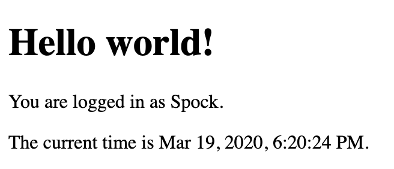

# 0x02.i18n
```Backend```
A Flask App that
- has parametrize Flask templates that display different languages
- infer the correct locale based
on URL parameters, user settings or request headers
- localize timestamps


#### Local time Display
